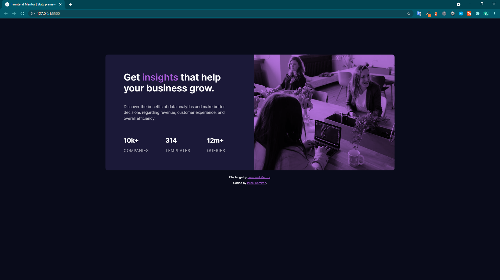

# Frontend Mentor - Stats preview card component solution

This is a solution to the [Stats preview card component challenge on Frontend Mentor](https://www.frontendmentor.io/challenges/stats-preview-card-component-8JqbgoU62). Frontend Mentor challenges help you improve your coding skills by building realistic projects. 

## Table of contents

- [Overview](#overview)
  - [The challenge](#the-challenge)
  - [Screenshot](#screenshot)
  - [Links](#links)
- [My process](#my-process)
  - [Built with](#built-with)
  - [What I learned](#what-i-learned)
- [Author](#author)


## Overview
- Build stats preview card component challenge hub

### The challenge

Users should be able to:

- View the optimal layout depending on their device's screen size

### Screenshot



### Links

- Solution URL: [Add solution URL here](https://your-solution-url.com)
- Live Site URL: [Add live site URL here](https://your-live-site-url.com)

## My process


### Built with

- Semantic HTML5 markup
- CSS custom properties
- Flexbox
- CSS Grid
- Mobile-first workflow
- Normalize CSS

### What I learned

Using variables for styles and mobile first workflow

```css
.proud-of-this-css {
  :root {
	font-size: 10px;
	--ff-primary: "Inter", sans-serif;
	--ff-secondary: "Lexend Deca", sans-serif;
	--fw-light: 300;
	--fw-reg: 400;
	--fw-med: 500;
	--fw-bold: 600;
	--fw-heavy: 700;
	--clr-primary-main-background: hsl(233, 47%, 7%);
	--clr-primary-card-background: hsl(244, 38%, 16%);
	--clr-primary-accent: hsl(277, 64%, 61%);
	--clr-neutral-white: hsl(0, 0%, 100%);
	--clr-neutral-main-paragraph: hsla(0, 0%, 100%, 0.75);
	--clr-neutral-main-stat-headings: hsla(0, 0%, 100%, 0.6);
	--fs-body: 1.5rem;
}
}
```

## Author

- Website - [Israel Ramirez](https://isra.netlify.app/)
- Frontend Mentor - [@yourusername](https://www.frontendmentor.io/profile/israelram)
- Twitter - [@yourusername](https://www.twitter.com/isDeveloperr)
